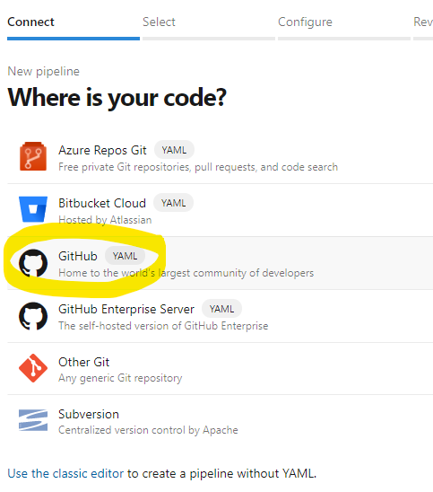

# Create an Azure DevOps pipeline

To debug CDS/AAD authentication issues on e.g. Azure DevOps build agents, it is useful
to run the sample console app of this repository on the actual build agent.

To do so requires a couple steps to setup an [Azure build pipeline](https://docs.microsoft.com/en-us/azure/devops/pipelines/create-first-pipeline?view=azure-devops&tabs=net%2Ctfs-2018-2%2Cbrowser#create-your-first-pipeline-1),
the actual steps are a variation of the above general purpose AzDevOps documentation.

## Preparation

- Make sure you have an Azure DevOps organization with the ability to create your own pipelines;
 see [Sign up for Azure Pipelines](https://docs.microsoft.com/en-us/azure/devops/pipelines/get-started/pipelines-sign-up?view=azure-devops) if necessary
- fork this repo [davidjenni/D365-OrgServiceSample](https://github.com/davidjenni/D365-OrgServiceSample) into your GitHub account,
using the Fork button


- OR: clone and push the above repo into a new git repo within your Azure DevOps organization
NOTE: the next section assumes you have forked the original GitHub repo into your GitHub account.

## Add as new build pipeline

- in your Azure DevOps pipeline panel, click the "New pipeline" button
- in the "Connect" step, select the "Github" YAML:



- in the "Select" step, filter and select to find your forked "D365-OrgServicSample" repository:


- in the "Configure" step, pick the first pipeline template, e.g. AspNet. The actual type doesn't matter, it will be overwritten.


- finish and save the new pipeline, accept the default name.
NOTE: Right now Azure DevOps doesn't have a better way to directly link an existing pipeline YAML file to a new pipeline.
Hence the creation of this new 'azure-pipelines1.yaml'...

## Modify the new pipeline to point to the existing YAML file

- in the list of pipelines, select and navigate to the just created pipeline
- in the top right corner, click the ```...``` elipses and select "Settings":


- in the settings dialog, select the original, already existing ```azure-pipelines.yml``` file and accept with "Save"


## Configure pipeline to use your PowerPlatform/CDS environment

- add 3 pipeline variables:
    - ```PA_BT_ORG_URL```  the URL to your CDS env, e.g. https://myenv.crm.dynamics.com
    - ```PA_BT_ORG_USER```  the user name, e.g. me@myenv.onmicrosoft.com or the application ID (appID) that is configured as Application User for your org, i.e. a guid
    - ```PA_BT_ORG_SECRET```  the user's password or the client secret for the above appID

Note that depending on your AAD configuration, username/password authentication
might not work from a headless build agent, as many enterprise AAD admins require
e.g. MFA and other interactive security conditions.
Use AppID/clientSecret above if that is mandated.

- select your pipeline and click the "Edit" button to open the YAML view
- from the top right corner, select the "Variables" button:


- enter the 3 pipeline variables as listed above

- you should end up with 3 variables like this:


- NOTE: Make sure that the variable with the client secret or password is indeed marked as "Secret"!!!!

## Run your pipeline

Queue a build for your pipeline. The pipeline will first build the simple console app and then launch the console app with the 3 pipeline variables.

The app will emit either its success log or emit errors.

At the end of the log, it will also emit the diagnostic log collected from the underlying CDS Connect Control.
It will indicate e.g. AAD errors or other connectivity issues.
